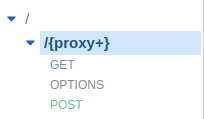

# SAML Auth with JWT Generator

This is an extensible SAML Auth Endpoint to get JWT tokens.

* It will generate a JWT Token after user login. 
* To manage it from client side, you have to capture PostMessage. Sample code at the end
	* if you deploy with serverless framework complete working sample is available

## Install dependencies

		$ cd backend
		$ npm install

## Run

		$ node app.js

## Working modes

* Local/Container/PaaS
* AWS Lambda environment

## Deployment requirements

* Serverless framework: https://www.serverless.com/framework/docs/getting-started/
* Setup AWS credentials: https://www.serverless.com/framework/docs/providers/aws/cli-reference/config-credentials/
* Install "serverless-s3-sync" plugin

        $ npm install --save serverless-s3-sync

* Update "serviceName" with your own in [setup.demo.json](https://github.com/davidayalas/saml-jwt/blob/master/setup.demo.json#L2)

* Basic env variables:

    - SAML_CERT: you idp saml certificate as string
    - IDP_HOST: your idp
    - JWT_SECRET: to sign JWT from SAML and validate from custom authorizer

* Deploy demo

        $ sls deploy
        $ sls info | grep ANY -m 1 | awk -F[/:] '{printf "var endpoint='\''https://"$4"'\'';"}' > html/endpoint.js
        $ sls s3sync

## Environment variables

- IDP_HOST = your idp host
- STAGE = pro (when exposing through AWS - API GW is mandatory to ensure redirects)

- SAML_DOMAIN = [API GW HOST]
- SAML_CERT = IDP public signing certificate
- SAML_PRIVATE_CERT = private cert
- SAML_ISSUER = your sp id

- JWT_SECRET = signing secret
- JWT_SAML_PROFILE = keys from the SAML Profile to add and sign in JWT Token (e.g. for auth purposes later)
- JWT_SAML_TTL = ttl in seconds

- ALLOWED_DOMAINS = domains, separated by comma, to allow postmessage
- ALLOWED_HOSTS_PATTERNS = host patterns (e.g. "subdomain.domain.com"), separated by comma, to allow postmessage. Useful to trust your own domain and don't need to declare ALLOWED_DOMAINS individually

## AWS API Gateway Setup 

- Resource:
	- /{proxy+} 
- Methods:
	- GET
	- POST

## Custom Authorizer for API Gateway

* Sample authorizer here: https://yos.io/2017/09/03/serverless-authentication-with-jwt/
* For authorizer and CORS, you have to setup gateway responses for 4xx:

## Sample client code to get JWT
		<html>
		<head></head>
		<body>
			
			<a id="login" href="#">Log in with SAML</a>

			

			
		</body>
		</html>
